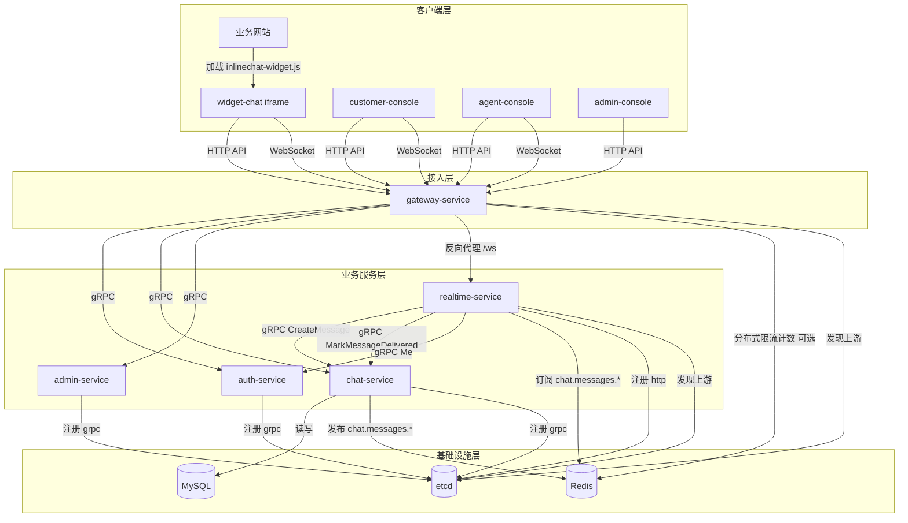
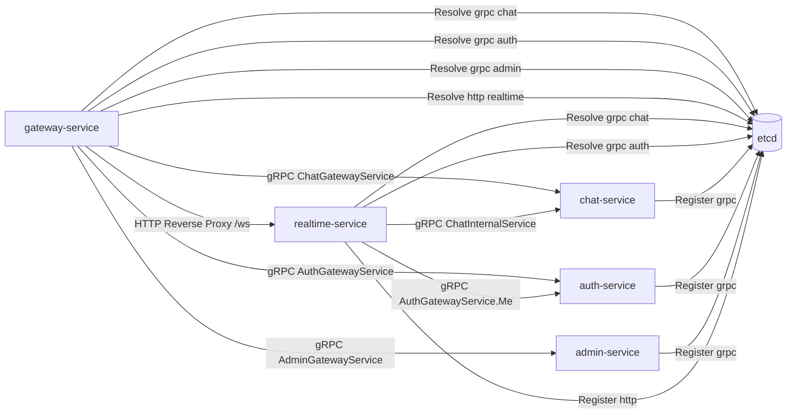
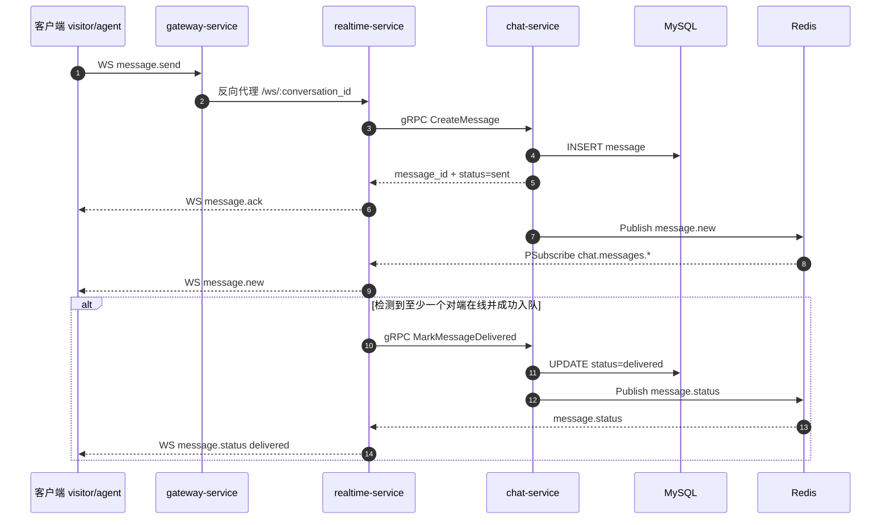
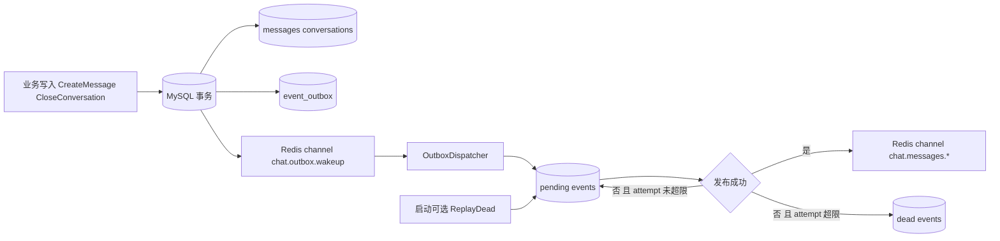
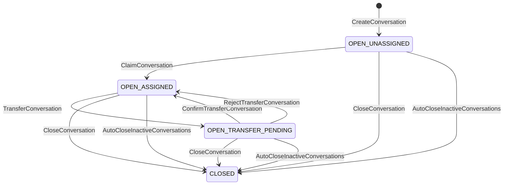
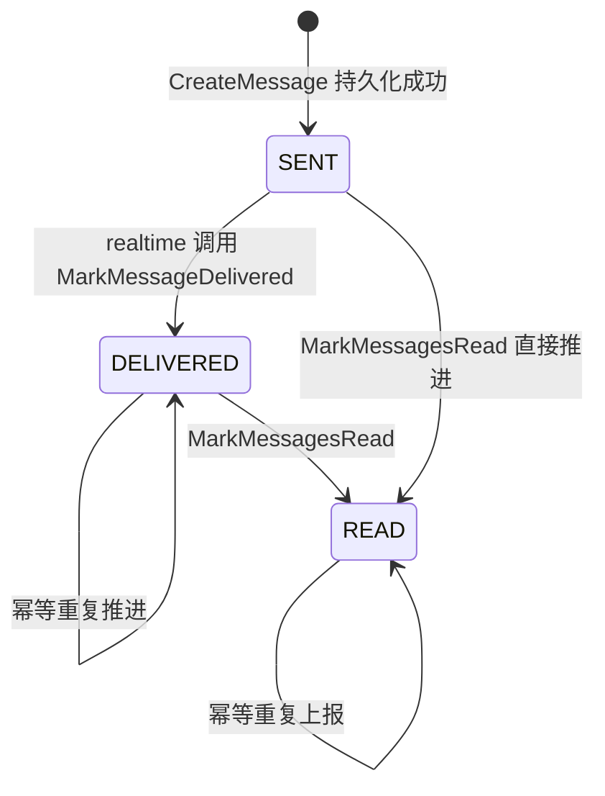
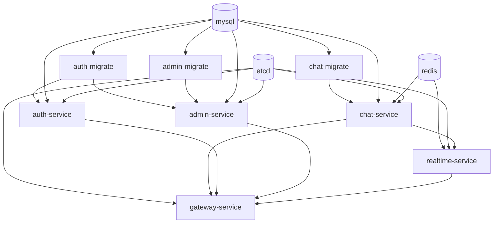
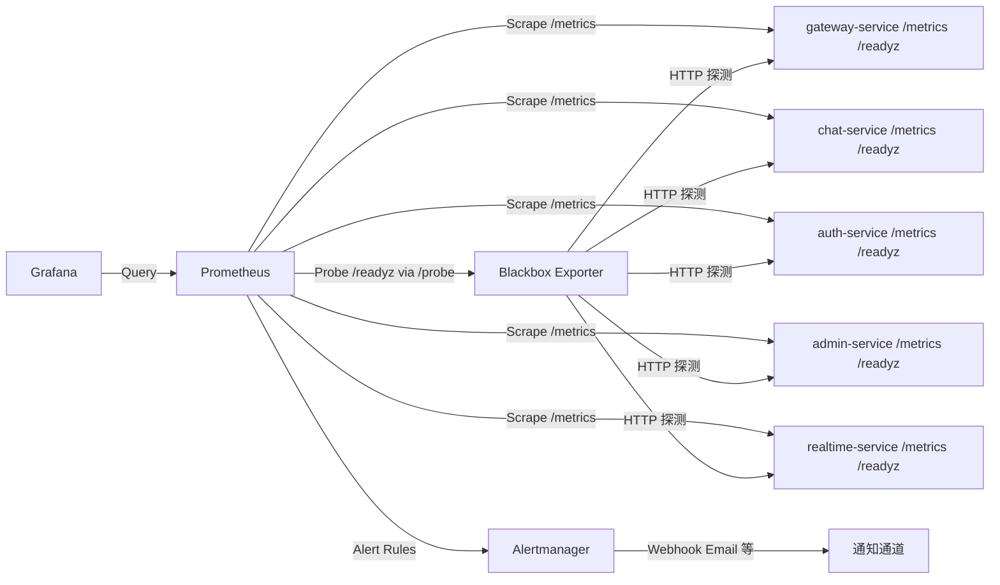

# InlineChat 架构图集合

## 1. 系统总览图

```mermaid
flowchart TB
  subgraph CLIENT[客户端层]
    HOST[业务网站]
    WIDGET[widget-chat iframe]
    CUSTOMER[customer-console]
    AGENT[agent-console]
    ADMIN[admin-console]
  end

  subgraph ACCESS[接入层]
    GW[gateway-service]
  end

  subgraph SERVICE[业务服务层]
    AUTH[auth-service]
    CHAT[chat-service]
    REALTIME[realtime-service]
    ADMINSVC[admin-service]
  end

  subgraph INFRA[基础设施层]
    MYSQL[(MySQL)]
    REDIS[(Redis)]
    ETCD[(etcd)]
  end

  HOST -->|加载 inlinechat-widget.js| WIDGET

  WIDGET -->|HTTP API| GW
  CUSTOMER -->|HTTP API| GW
  AGENT -->|HTTP API| GW
  ADMIN -->|HTTP API| GW

  WIDGET -->|WebSocket| GW
  CUSTOMER -->|WebSocket| GW
  AGENT -->|WebSocket| GW

  GW -->|gRPC| AUTH
  GW -->|gRPC| CHAT
  GW -->|gRPC| ADMINSVC
  GW -->|反向代理 /ws| REALTIME

  REALTIME -->|gRPC CreateMessage| CHAT
  REALTIME -->|gRPC MarkMessageDelivered| CHAT
  REALTIME -->|gRPC Me| AUTH

  CHAT -->|读写| MYSQL
  CHAT -->|发布 chat.messages.*| REDIS
  REALTIME -->|订阅 chat.messages.*| REDIS
  GW -->|分布式限流计数 可选| REDIS

  AUTH -->|注册 grpc| ETCD
  CHAT -->|注册 grpc| ETCD
  ADMINSVC -->|注册 grpc| ETCD
  REALTIME -->|注册 http| ETCD
  GW -->|发现上游| ETCD
  REALTIME -->|发现上游| ETCD
```

## 2. 服务调用与发现图

```mermaid
flowchart LR
  ETCD[(etcd)]

  GW[gateway-service]
  RT[realtime-service]

  CHAT[chat-service]
  AUTH[auth-service]
  ADMIN[admin-service]

  GW -->|Resolve grpc chat| ETCD
  GW -->|Resolve grpc auth| ETCD
  GW -->|Resolve grpc admin| ETCD
  GW -->|Resolve http realtime| ETCD

  RT -->|Resolve grpc chat| ETCD
  RT -->|Resolve grpc auth| ETCD

  CHAT -->|Register grpc| ETCD
  AUTH -->|Register grpc| ETCD
  ADMIN -->|Register grpc| ETCD
  RT -->|Register http| ETCD

  GW -->|gRPC ChatGatewayService| CHAT
  GW -->|gRPC AuthGatewayService| AUTH
  GW -->|gRPC AdminGatewayService| ADMIN
  GW -->|HTTP Reverse Proxy /ws| RT

  RT -->|gRPC ChatInternalService| CHAT
  RT -->|gRPC AuthGatewayService.Me| AUTH
```

## 3. 实时消息主链路时序图

```mermaid
sequenceDiagram
  autonumber
  participant C as 客户端 visitor/agent
  participant GW as gateway-service
  participant RT as realtime-service
  participant CH as chat-service
  participant DB as MySQL
  participant RD as Redis

  C->>GW: WS message.send
  GW->>RT: 反向代理 /ws/:conversation_id
  RT->>CH: gRPC CreateMessage
  CH->>DB: INSERT message
  CH-->>RT: message_id + status=sent
  RT-->>C: WS message.ack

  CH->>RD: Publish message.new
  RD-->>RT: PSubscribe chat.messages.*
  RT-->>C: WS message.new

  alt 检测到至少一个对端在线并成功入队
    RT->>CH: gRPC MarkMessageDelivered
    CH->>DB: UPDATE status=delivered
    CH->>RD: Publish message.status
    RD-->>RT: message.status
    RT-->>C: WS message.status delivered
  end
```

## 4. Outbox 一致性机制图

```mermaid
flowchart LR
  WRITE[业务写入 CreateMessage CloseConversation]
  TX[(MySQL 事务)]
  BIZ[(messages conversations)]
  OUTBOX[(event_outbox)]
  WAKEUP[Redis channel chat.outbox.wakeup]
  DISPATCHER[OutboxDispatcher]
  PENDING[(pending events)]
  CHECK{发布成功}
  BUS[Redis channel chat.messages.*]
  DEAD[(dead events)]
  REPLAY[启动可选 ReplayDead]

  WRITE --> TX
  TX --> BIZ
  TX --> OUTBOX
  TX --> WAKEUP

  WAKEUP --> DISPATCHER
  DISPATCHER --> PENDING
  PENDING --> CHECK

  CHECK -->|是| BUS
  CHECK -->|否 且 attempt 未超限| PENDING
  CHECK -->|否 且 attempt 超限| DEAD

  REPLAY --> PENDING
```

## 5. 会话状态机图

```mermaid
stateDiagram-v2
  [*] --> OPEN_UNASSIGNED: CreateConversation

  OPEN_UNASSIGNED --> OPEN_ASSIGNED: ClaimConversation

  OPEN_ASSIGNED --> OPEN_TRANSFER_PENDING: TransferConversation
  OPEN_TRANSFER_PENDING --> OPEN_ASSIGNED: ConfirmTransferConversation
  OPEN_TRANSFER_PENDING --> OPEN_ASSIGNED: RejectTransferConversation

  OPEN_UNASSIGNED --> CLOSED: CloseConversation
  OPEN_ASSIGNED --> CLOSED: CloseConversation
  OPEN_TRANSFER_PENDING --> CLOSED: CloseConversation

  OPEN_UNASSIGNED --> CLOSED: AutoCloseInactiveConversations
  OPEN_ASSIGNED --> CLOSED: AutoCloseInactiveConversations
  OPEN_TRANSFER_PENDING --> CLOSED: AutoCloseInactiveConversations
```

## 6. 消息状态机图

```mermaid
stateDiagram-v2
  [*] --> SENT: CreateMessage 持久化成功
  SENT --> DELIVERED: realtime 调用 MarkMessageDelivered
  DELIVERED --> READ: MarkMessagesRead
  SENT --> READ: MarkMessagesRead 直接推进

  DELIVERED --> DELIVERED: 幂等重复推进
  READ --> READ: 幂等重复上报
```

## 7. Docker Compose 部署拓扑图

```mermaid
flowchart TB
  MYSQL[(mysql)]
  REDIS[(redis)]
  ETCD[(etcd)]

  CHAT_MIGRATE[chat-migrate]
  AUTH_MIGRATE[auth-migrate]
  ADMIN_MIGRATE[admin-migrate]

  CHAT[chat-service]
  AUTH[auth-service]
  ADMIN[admin-service]
  REALTIME[realtime-service]
  GW[gateway-service]

  MYSQL --> CHAT_MIGRATE
  MYSQL --> AUTH_MIGRATE
  MYSQL --> ADMIN_MIGRATE

  CHAT_MIGRATE --> CHAT
  AUTH_MIGRATE --> AUTH
  AUTH_MIGRATE --> ADMIN
  ADMIN_MIGRATE --> ADMIN

  MYSQL --> CHAT
  MYSQL --> AUTH
  MYSQL --> ADMIN

  REDIS --> CHAT
  REDIS --> REALTIME

  ETCD --> CHAT
  ETCD --> AUTH
  ETCD --> ADMIN
  ETCD --> REALTIME
  ETCD --> GW

  CHAT --> REALTIME

  CHAT --> GW
  AUTH --> GW
  ADMIN --> GW
  REALTIME --> GW
```

## 8. 监控与告警拓扑图

```mermaid
flowchart LR
  PROM[Prometheus]
  ALERT[Alertmanager]
  GRAFANA[Grafana]
  BLACKBOX[Blackbox Exporter]
  ONCALL[通知通道]

  GW[gateway-service /metrics /readyz]
  CHAT[chat-service /metrics /readyz]
  AUTH[auth-service /metrics /readyz]
  ADMIN[admin-service /metrics /readyz]
  REALTIME[realtime-service /metrics /readyz]

  PROM -->|Scrape /metrics| GW
  PROM -->|Scrape /metrics| CHAT
  PROM -->|Scrape /metrics| AUTH
  PROM -->|Scrape /metrics| ADMIN
  PROM -->|Scrape /metrics| REALTIME

  PROM -->|Probe /readyz via /probe| BLACKBOX
  BLACKBOX -->|HTTP 探测| GW
  BLACKBOX -->|HTTP 探测| CHAT
  BLACKBOX -->|HTTP 探测| AUTH
  BLACKBOX -->|HTTP 探测| ADMIN
  BLACKBOX -->|HTTP 探测| REALTIME

  PROM -->|Alert Rules| ALERT
  ALERT -->|Webhook Email 等| ONCALL

  GRAFANA -->|Query| PROM
```
